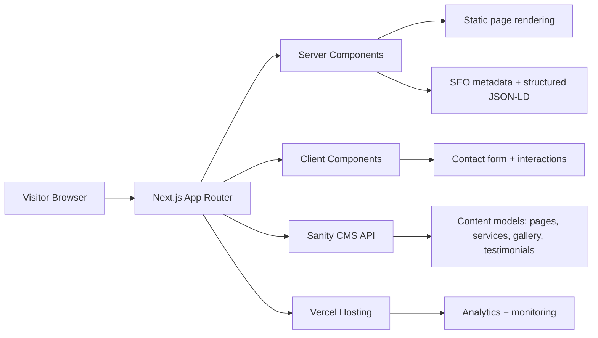

# Architecture Document

## 1. Project Overview
Mellor Dog School requires a premium, conversion-focused website that communicates trust, expertise, and clear outcomes across core dog training services. The site must appeal to dog owners in the local market, provide detailed service information, and encourage enquiries without friction.

## 2. Recommended Technology Stack
- Next.js App Router
- React
- TypeScript
- Tailwind CSS
- Framer Motion
- React Hook Form
- Zod
- Sanity CMS
- ESLint + Prettier
- Vercel

## 3. Folder Structure
```text
app/
  (marketing)/
  api/
  globals.css
  layout.tsx
components/
  marketing/
  layout/
  forms/
  ui/
content/
  schemas/
  queries/
lib/
  seo/
  utils.ts
  validation/
sanity/
  schema/
  lib/
public/
  images/
  icons/
styles/
  tokens.css
types/
  content.ts
tests/
  e2e/
  unit/
```

## 4. Architecture Diagram


## 5. Routing Plan
### Route map
- /
- /puppy-classes
- /doggy-day-care
- /obedience-training
- /gundog-training
- /protection-training
- /sheep-dog-training
- /one-to-one-training
- /success-stories
- /testimonials
- /gallery
- /faq
- /contact
- /privacy-policy

All routes should use consistent page wrappers with optional service-specific hero callouts and CTA blocks.

## 6. Component Hierarchy
```text
AppShell
├── Header
│   ├── Brand
│   ├── MainNav
│   └── MobileMenu
├── Main
│   ├── PageHero
│   ├── IntroSection
│   ├── ServiceGrid
│   ├── StatsStrip
│   ├── TestimonialCarousel
│   ├── FAQAccordion
│   ├── GalleryGrid
│   ├── CTASection
│   └── ContactForm
├── Footer
│   ├── ContactInfo
│   ├── QuickLinks
│   └── LegalLinks
└── Toast/Notification layer
```

## 7. Design System
### Layout
- Max content width: 1200px
- Section spacing: 80–120px desktop / 48–72px mobile
- 12-column responsive grid
- Clear CTA repetition without visual clutter

### Interaction patterns
- Gentle motion on entering sections and cards
- Hover states that maintain accessibility contrast
- Accordion for FAQs and dense info
- Sticky CTA on mobile for key conversion moments

## 8. Visual Language
The site should feel premium and trustworthy rather than clinical. Use a refined mix of natural tones, confident typography, and generous whitespace. The visual system should support a calm but authoritative tone appropriate for a professional dog school.

## 9. Color Palette
- Forest green: #173A2A
- Ochre: #C88D42
- Clay: #D77A5B
- Ivory: #F7F2EA
- White: #FFFFFF
- Slate: #4B5B5B
- Sand border: #E5DCCB
- Sage success: #7EA28D

## 10. Typography
- Headings: Manrope or Plus Jakarta Sans
- Body: Inter
- Strong typographic rhythm with short paragraphs and defined hierarchy
- Headings should feel confident and spacious; body copy should remain highly readable

## 11. Icon Strategy
- Use Lucide icons consistently for navigation, services, and CTAs
- Keep icon style minimal and line-based for a premium, clean interface
- Use photography as the dominant visual asset instead of illustrative heavy-weight graphics

## 12. CMS Model
### Sanity documents
- `siteSettings`
- `page`
- `service`
- `testimonial`
- `galleryItem`
- `faq`
- `successStory`
- `staffMember`

### Content responsibilities
- Service pages: structured content and pricing details
- Testimonial pages: quotes, rating, outcomes
- Gallery: category-based media collections
- FAQ: searchable knowledge base content
- Site settings: metadata, contact data, social links, legal pages

## 13. Security and Data Handling
- Validate contact form payloads with Zod on the server side
- Use environment variables for all secrets and CMS access tokens
- Verify sanitization of user-submitted text before persistence or email routing
- Ensure privacy and consent text is visible and accessible on any forms

## 14. Performance Strategy
- Prefer static generation for marketing pages
- Compress and optimise images via Next.js image handling
- Use partial hydration and minimal client-side logic
- Defer non-critical motion and widgets
- Keep the CSS footprint small and token-driven

## 15. Build Roadmap
### Stage 1: architecture and design foundation
- Finalise routing and page templates
- Define visual system and CMS structure

### Stage 2: marketing pages
- Build home, service, story, gallery, testimonial pages
- Reusable content and CTA blocks

### Stage 3: CMS integration and forms
- Connect Sanity and implement contact forms
- Add FAQ and gallery editing workflows

### Stage 4: accessibility and SEO hardening
- Metadata, schema, WCAG checks, performance optimisation

### Stage 5: launch and QA
- Vercel deployment, analytics, cross-browser verification, content refinement

## 16. Decision Gate
Implementation should not proceed until the architecture, standards, and decision log are reviewed and approved.
